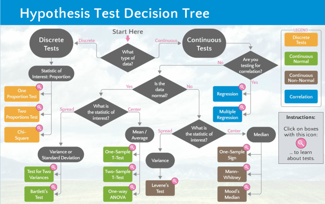

## Understanding Business

The first step in the Data Science Life Cycle is to understand the business we are about to interperet the Data. The data itself does explain quite a bit about the business model:

* This is a small business with only nine employees.
* Employees are responsible for selling to specific regions which subset into specific territories.
* Order quantities are large and since suppliers are involved, either a specialty grocery and/or restaurant supplier.

## The Database

Northwind database--a free, open-source dataset created by Microsoft containing data from a fictional company. 

## Data Mining

The data is provided via a SQLite database. After glancing through the tables in https://sqliteonline.com/, there are a few notes for reference:

* The tables CustomerCustomerDemo and CustomerDemographics have no information in htem. 
* While the ERD tables have all ID columns listed, they are not specifically labeled those items in the tables. Only "Id" is provided. This will mean renaming may be necessary for the purpose of joining tables(dataframes).
* Since basic SQL queries will not be efficient for the purposes of the project, we will convert the database into a pandas dataframe using sqlalchemy and pandas.

## Hypothesis Testing

### Decision Tree for Type of Test to be Used

### Question 1: Do discounts have a statistically significant effect on the number of products customers order? If so, at what level(s) of discount?

#### Ho = Discounts do not have a significant effect on the number of products customers order.
#### Ha = Discounts do have a significant positive effect on the number of products customers order.

### Question 2: Did any discontinued products have a significant effect on order quantity to justify replacement?¶

#### Ho = Discontinued products had no effect on order quantity.¶
#### Ha = There are one or more discontinued products that had a positive effect on order quantity

### Question 3: Is there a region that expansion should be focused?¶

#### Ho = There is no significant difference in total sales between regions.
#### Ha = There is a significant proportion of total sales in certain region(s).

### Question 4: Do any categories significantly underperform/outperform?

#### Ho = All categories of products perform the same¶
#### Ha = There are one or more categories of products that either underperform or outperform others.
